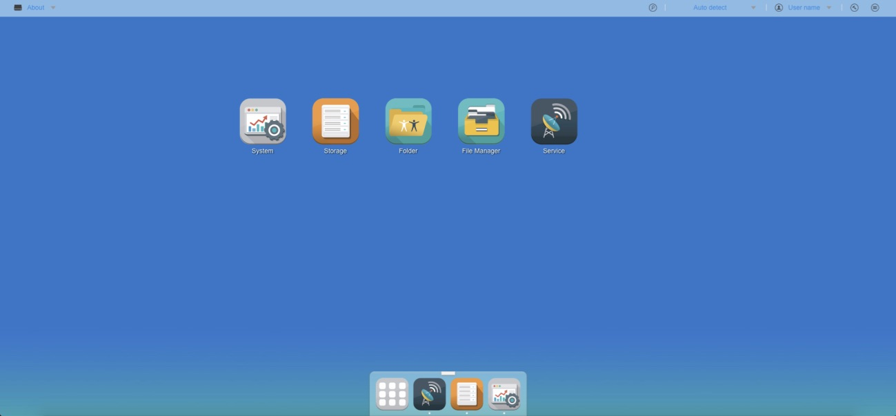
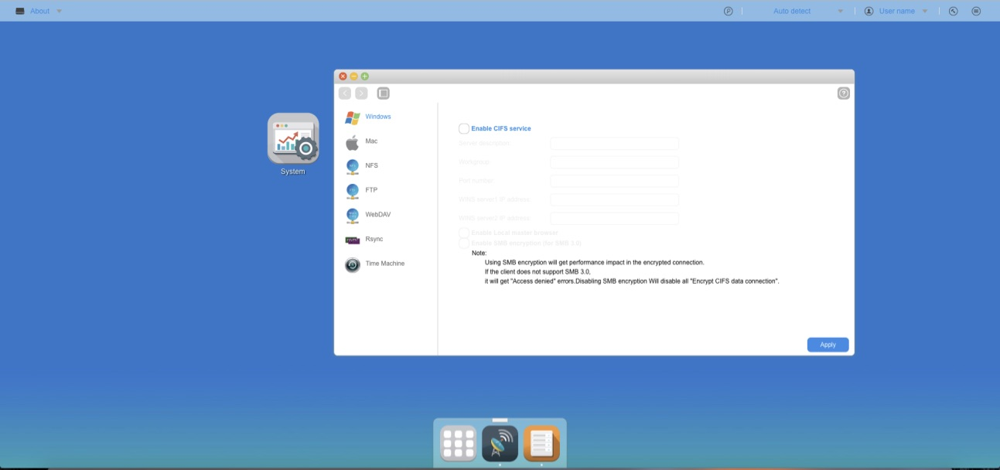
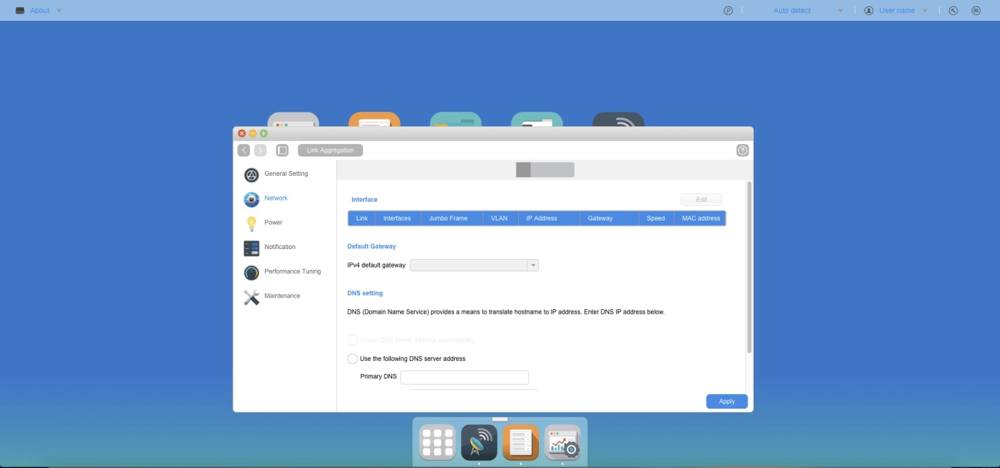

# Ext-Desktop-Sample

<h3>Description</h3>
  Extjs Desktop sample 

<h3>Image</h3>
  

      
  

  

      
  

  

      
  

<h3>Architecture</h3>
  <pre>
    ├── README.md
    ├── app
    │   ├── AppWindow
    │   ├── Application.js
    │   ├── Desktop
    │   ├── FileManager
    │   ├── Folder
    │   ├── Main
    │   ├── Service
    │   ├── Spotlight
    │   ├── StorageManagement
    │   ├── SystemSetup
    │   ├── Utils
    │   ├── base_app.json
    │   ├── js
    │   ├── lib
    │   └── ux
    ├── app.js
    ├── css
    │   └── desktop.css
    ├── http_header.php
    ├── img
    │   ├── app_all.png
    │   ├── app_filemanager.png
    │   ├── app_folder.png
    │   ├── app_replace.png
    │   ├── app_service.png
    │   ├── app_storage.png
    │   ├── app_system.png
    │   ├── btnSearchFile.png
    │   ├── icon-loading.gif
    │   ├── icon-loading16x16.gif
    │   ├── taskbar_icon_disk.png
    │   ├── taskbar_icon_downarrow.png
    │   ├── taskbar_icon_help.png
    │   ├── taskbar_icon_multi.png
    │   ├── taskbar_icon_notification.png
    │   ├── taskbar_icon_search.png
    │   ├── taskbar_icon_userhead_default.png
    │   └── wallpaper.jpg
    ├── index.html
    ├── js
    │   ├── base.js
    │   ├── ext
    │   ├── headSource.json
    │   ├── keyword.js
    │   ├── language
    │   ├── language.js
    │   ├── other
    │   ├── pluploader.js
    │   ├── prejson.js
    │   └── require.js
    ├── json
    │   ├── app.json
    │   ├── dock.json
    │   ├── dock_bkp.json
    │   └── shortcut.json
    ├── sample001.png
    ├── sample002.png
    ├── sample003.png
    └── theme
        ├── Readme.md
        ├── ThemeDemoApp-all_01.css
        ├── ThemeDemoApp-all_02.css
        ├── ThemeTopApp-all.css
        └── images
  </pre>
